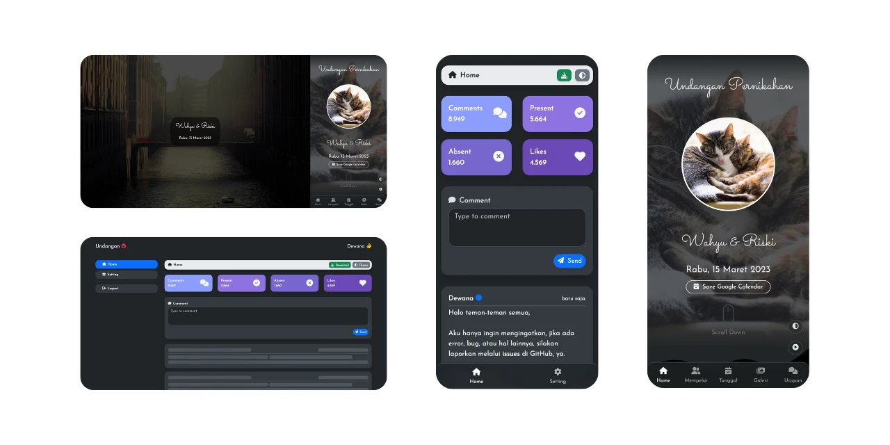

# Undangan - Wedding Invitation Website

Interactive wedding invitation website template with animation, countdown, RSVP flow, and share-ready presentation.



[](https://opensource.org/licenses/MIT)

## Overview

This project provides a customizable invitation landing page built with HTML, CSS, and JavaScript.

Main goals:

- Beautiful visual presentation
- Mobile-friendly invitation experience
- Easy text/content customization
- Simple static deployment workflow

## Features

- Animated hero and section transitions
- Guest greeting via URL query parameter
- Dashboard + guest page structure
- Optional comments/integration hooks
- Optional GIF/Tenor integration
- Build script for deployable `public/` output

## Tech Stack

- Bootstrap 5
- Vanilla JavaScript
- AOS (scroll animation)
- Font Awesome
- Canvas Confetti

## Local Development

```bash
npm install
npm run dev
```

Open `http://localhost:8080`.

## Build for Deployment

```bash
npm run build:public
```

Deploy the generated `public/` directory to your static hosting provider.

## Customization

1. Edit invitation content in `index.html`
2. Update visual assets in `assets/`
3. Adjust styles in `css/`
4. Update behavior in `js/`
5. If comments are not needed, remove related `data-url` and `data-key` attributes in `<body>`

## Project Structure

- `index.html` - Guest invitation page
- `dashboard.html` - Dashboard/config page
- `assets/` - Images and static assets
- `css/` - Styles
- `js/` - Frontend logic
- `package.json` - Scripts and dependencies

## Credits

Visual assets are sourced from Pixabay and related free resources.

## Contributing

Contributions are welcome. Open an issue or pull request with clear steps and context.

## Security

If you discover a security issue, please open a private report to the repository owner.

## License

MIT. See [LICENSE](LICENSE).
